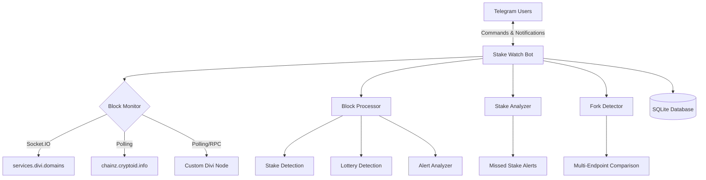
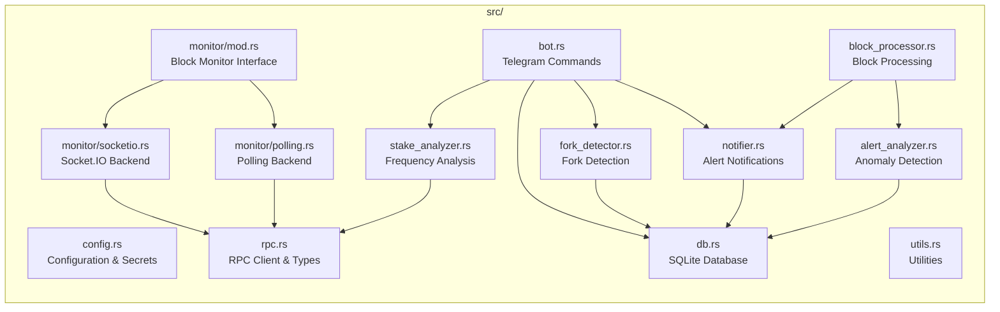

# Stake Watch

**Telegram bot for monitoring Divi blockchain staking rewards, lottery wins, and chain anomalies.**

[](https://github.com/DiviDomains/stake_watch/actions/workflows/ci.yml)
[](https://github.com/DiviDomains/stake_watch/releases)
[](https://opensource.org/licenses/MIT)

## Features

- **Real-time staking reward notifications** - Detects when your address stakes and sends immediate updates
- **Lottery win detection and alerts** - Alerts users who win Divi lottery tickets
- **Missed stake detection** - Alerts if an address hasn't staked when expected based on balance and network supply
- **Staking frequency analysis** - Estimates expected staking interval based on balance vs network supply
- **Blockchain anomaly detection** - Alerts on unusual transactions (large transfers, many inputs/outputs, OP_RETURN data, non-standard scripts)
- **Fork detection** - Monitors multiple blockchain endpoints and alerts on chain forks
- **Multi-backend support** - Choose from services.divi.domains (real-time), chainz (polling), or custom Divi node (RPC)
- **Cross-platform binaries** - Pre-built for Linux, macOS (Intel & Apple Silicon), and Windows
- **SQLite persistence** - Stores user data, stakes, and alerts locally with no external database required
- **Admin controls** - Manage fork detection endpoints and configure alert thresholds

## Architecture

### System Overview



### Component Architecture



## Bot Commands

| Command | Description | Access | Example |
|---------|-------------|--------|---------|
| `/start` | Welcome message and setup | All | `/start` |
| `/help` | Show command reference | All | `/help` |
| `/watch <address> [label]` | Watch a Divi address for staking | All | `/watch D8nQRyfgS5xL7dZDC39i9s41iiCAEeq7Zk Staking` |
| `/unwatch <address>` | Stop watching an address | All | `/unwatch D8nQRyfgS5xL7dZDC39i9s41iiCAEeq7Zk` |
| `/list` | List all watched addresses | All | `/list` |
| `/analyze [address]` | Get staking performance analysis | All | `/analyze D8nQRyfgS5xL7dZDC39i9s41iiCAEeq7Zk` |
| `/status` | Bot health status and statistics | All | `/status` |
| `/alerts` | View current alert subscriptions | All | `/alerts` |
| `/alert <type> [threshold]` | Subscribe to anomaly alerts | All | `/alert large_tx 5000000` |
| `/unalert <type>` | Unsubscribe from anomaly alerts | All | `/unalert large_tx` |
| `/forkwatch` | Subscribe to fork detection alerts | All | `/forkwatch` |
| `/forkunwatch` | Unsubscribe from fork alerts | All | `/forkunwatch` |
| `/forkstatus` | View fork detection status | All | `/forkstatus` |
| `/addfork <name> <url>` | Add a fork detection endpoint | Admin | `/addfork backup https://backup.example.com/api/rpc/` |
| `/removefork <name>` | Remove a fork detection endpoint | Admin | `/removefork backup` |

### Alert Types

Subscribe to blockchain anomalies with customizable thresholds:

| Type | Description | Default Threshold | Custom |
|------|-------------|-------------------|--------|
| `large_tx` | Transaction exceeds threshold | 1,000,000 DIVI | Yes |
| `large_block` | Block total value exceeds threshold | 10,000,000 DIVI | Yes |
| `many_inputs` | Transaction has many inputs | 10 inputs | Yes |
| `many_outputs` | Transaction has many outputs | 10 outputs | Yes |
| `op_return` | Transaction contains OP_RETURN data | N/A | No |
| `unusual_script` | Non-standard script type detected | N/A | No |
| `anything_unusual` | Subscribe to all anomalies | Defaults | Yes (per type) |

## Quick Start

### Download Binary

Pre-built binaries are available for Linux, macOS, and Windows:

```bash
# Linux x86_64
curl -LO https://github.com/DiviDomains/stake_watch/releases/latest/download/stake_watch-linux-x86_64
chmod +x stake_watch-linux-x86_64

# macOS Apple Silicon (ARM64)
curl -LO https://github.com/DiviDomains/stake_watch/releases/latest/download/stake_watch-macos-aarch64
chmod +x stake_watch-macos-aarch64

# macOS Intel (x86_64)
curl -LO https://github.com/DiviDomains/stake_watch/releases/latest/download/stake_watch-macos-x86_64
chmod +x stake_watch-macos-x86_64

# Windows (PowerShell)
Invoke-WebRequest -Uri "https://github.com/DiviDomains/stake_watch/releases/latest/download/stake_watch-windows.exe" -OutFile "stake_watch.exe"
```

### Configure

1. **Create a Telegram bot** via [@BotFather](https://t.me/botfather) and note your bot token
2. **Copy `.env.example` to `.env`** and set required variables
3. **Choose a backend** (optional - default uses services.divi.domains)

```bash
cp .env.example .env
# Edit .env and set TELEGRAM_BOT_TOKEN=your_token_here
```

### Run

```bash
# Using default config (services.divi.domains)
./stake_watch-linux-x86_64

# Using custom config
./stake_watch-linux-x86_64 --config config/custom-node.toml

# View command-line options
./stake_watch-linux-x86_64 --help
```

## Configuration

Stake Watch separates configuration into two files:

- **`.toml` files** - Settings that control behavior (safe to commit to git)
- **`.env` file** - Secrets like API keys and RPC credentials (git-ignored)

### Backend Options

Choose the data source that best fits your needs:

#### Option 1: services.divi.domains (Default, Real-time)

Real-time block updates via Socket.IO with the lowest latency. Recommended for most users.

**Config:** `config/services-divi-domains.toml`

```toml
[general]
db_path = "./data/stake_watch.db"
network_staking_supply = 4_000_000_000
alert_multiplier = 3
alert_check_interval_secs = 300
max_watches_per_user = 20

[backend]
type = "socketio"
rpc_url = "https://services.divi.domains/api/rpc/"
explorer_url = "https://services.divi.domains/explorer"

[backend.socketio]
url = "https://services.divi.domains"
path = "/zmq/socket.io"
network_filter = "mainnet"

[fork_detection]
enabled = false
check_interval_secs = 300

[[fork_detection.endpoints]]
name = "services"
rpc_url = "https://services.divi.domains/api/rpc/"
```

**Advantages:**
- Real-time block updates
- Lottery detection supported
- No API keys required
- No local infrastructure

**Disadvantages:**
- Depends on external service

#### Option 2: chainz.cryptoid.info (Polling)

Polling-based blockchain data via REST API. No lottery detection, but works independently.

**Config:** `config/chainz.toml`

```toml
[general]
db_path = "./data/stake_watch.db"
network_staking_supply = 4_000_000_000
alert_multiplier = 3
alert_check_interval_secs = 300
max_watches_per_user = 20

[backend]
type = "polling"
rpc_url = "https://chainz.cryptoid.info/divi/api.dws"
explorer_url = "https://chainz.cryptoid.info/divi"

[backend.polling]
interval_secs = 120

[backend.rpc_auth]
enabled = false
```

**Advantages:**
- Independent operation
- No authentication required
- Stable and reliable

**Disadvantages:**
- Polling lag (configurable, default 2 minutes)
- Lottery detection not available
- Rate limits may apply

**Optional: Get higher rate limits**

```bash
# .env
CHAINZ_API_KEY=your_api_key_here
```

#### Option 3: Custom Divi Node (RPC)

Full control with your own Divi node. Supports all features including fork detection.

**Config:** `config/custom-node.toml`

```toml
[general]
db_path = "./data/stake_watch.db"
network_staking_supply = 4_000_000_000
alert_multiplier = 3
alert_check_interval_secs = 300
max_watches_per_user = 20

[backend]
type = "polling"
rpc_url = "http://127.0.0.1:51473"
explorer_url = "https://services.divi.domains/explorer"

[backend.polling]
interval_secs = 60

[backend.rpc_auth]
enabled = true

[fork_detection]
enabled = true
check_interval_secs = 300

[[fork_detection.endpoints]]
name = "local-node"
rpc_url = "http://127.0.0.1:51473"

[[fork_detection.endpoints]]
name = "services"
rpc_url = "https://services.divi.domains/api/rpc/"
```

**Requirements:**

1. Divi daemon running with RPC enabled
2. Edit `~/.divi/divi.conf`:
   ```
   server=1
   rpcuser=myuser
   rpcpassword=mypassword
   rpcport=51473
   ```
3. Restart daemon: `divid`

**Environment Variables:**

```bash
# .env
RPC_USERNAME=myuser
RPC_PASSWORD=mypassword
```

**Advantages:**
- Full control over data source
- All features supported
- Fork detection with multiple endpoints
- Lower latency

**Disadvantages:**
- Requires running Divi node
- More setup and maintenance
- Uses server resources

### Environment Variables

```bash
# REQUIRED
TELEGRAM_BOT_TOKEN=your_bot_token_from_botfather

# OPTIONAL: Admin user IDs (comma-separated Telegram user IDs)
# Only admins can add/remove fork detection endpoints
ADMIN_TELEGRAM_IDS=123456789,987654321

# OPTIONAL: RPC Authentication (for custom node backend)
RPC_USERNAME=myuser
RPC_PASSWORD=mypassword

# OPTIONAL: Chainz API key (for higher rate limits)
CHAINZ_API_KEY=your_api_key_here
```

### General Configuration Options

| Option | Default | Description |
|--------|---------|-------------|
| `db_path` | `./data/stake_watch.db` | Path to SQLite database |
| `network_staking_supply` | 4,000,000,000 | Total DIVI in network staking supply |
| `alert_multiplier` | 3 | Multiplier for missed stake threshold |
| `alert_check_interval_secs` | 300 | How often to check for missed stakes |
| `max_watches_per_user` | 20 | Maximum addresses per user |

**Note on `network_staking_supply`:** This value is used to calculate expected staking frequency. Adjust if the actual network supply changes significantly.

## Staking Analysis

### How Frequency Estimation Works

Stake Watch estimates when you should expect your next stake based on your balance relative to the total network staking supply.

**Formula:**

```
Probability per block = balance / network_staking_supply
Expected blocks = 1 / probability
Expected time = expected_blocks * 60 seconds (block time)
Clamped to [1 hour, 1 year]
```

**Example calculations with 4 billion DIVI network supply:**

| Balance | Probability | Expected Blocks | Expected Time |
|---------|------------|-----------------|---------------|
| 10,000 DIVI | 1 in 400,000 | 400,000 blocks | ~277 days |
| 100,000 DIVI | 1 in 40,000 | 40,000 blocks | ~27.7 days |
| 1,000,000 DIVI | 1 in 4,000 | 4,000 blocks | ~2.77 days |
| 10,000,000 DIVI | 1 in 400 | 400 blocks | ~6.7 hours |
| 100,000,000 DIVI | 1 in 40 | 40 blocks | ~40 minutes |

### Missed Stake Alerts

A missed stake alert fires when:

```
time_since_last_stake > expected_interval * alert_multiplier
```

With default `alert_multiplier = 3`, you'll be alerted if staking takes 3x longer than expected.

**Important details:**

- **Grace period:** New addresses get a 24-hour grace period before alerts activate
- **Cooldown:** After an alert, you won't receive another for 1 hour (prevents spam)
- **Manual reset:** Use `/analyze` command to see detailed stats and reset alert timer if needed

### Using `/analyze` Command

Get detailed staking statistics for an address:

```
/analyze D8nQRyfgS5xL7dZDC39i9s41iiCAEeq7Zk
```

Returns:
- Current balance
- Last stake timestamp and amount
- Expected staking interval
- Alerts enabled status
- Network statistics

## Fork Detection

Fork detection monitors multiple blockchain RPC endpoints and alerts users if the endpoints disagree on the current block hash at the same height.

### How It Works

1. **Multiple endpoints** are configured (e.g., local node + services.divi.domains)
2. **Periodic checks** compare block hashes at the current network height
3. **Disagreement detected** → Fork alert sent to subscribers
4. **Users can subscribe** with `/forkwatch` to receive notifications

### Configuration

Enable in `config/custom-node.toml`:

```toml
[fork_detection]
enabled = true
check_interval_secs = 300  # Check every 5 minutes

[[fork_detection.endpoints]]
name = "local-node"
rpc_url = "http://127.0.0.1:51473"

[[fork_detection.endpoints]]
name = "services"
rpc_url = "https://services.divi.domains/api/rpc/"
```

### Admin Management

Only users in `ADMIN_TELEGRAM_IDS` can manage endpoints:

```bash
# Add an endpoint
/addfork backup https://backup.example.com/api/rpc/

# Remove an endpoint
/removefork backup

# Check status
/forkstatus
```

### User Subscription

Any user can subscribe to fork alerts:

```bash
# Subscribe
/forkwatch

# Unsubscribe
/forkunwatch

# View status
/forkstatus
```

## Deployment

### Deploy to Linux Server

**Prerequisites:**
- SSH access to server
- ~50MB disk space for binary + database
- Network access to blockchain RPC endpoint

**Steps:**

```bash
# 1. Download the latest binary
curl -LO https://github.com/DiviDomains/stake_watch/releases/latest/download/stake_watch-linux-x86_64
chmod +x stake_watch-linux-x86_64

# 2. Create application directory
sudo mkdir -p /opt/stake-watch/{config,data}
sudo chown $USER:$USER /opt/stake-watch

# 3. Copy files
cp stake_watch-linux-x86_64 /opt/stake-watch/stake_watch
cp config/config.toml /opt/stake-watch/config/
cp .env /opt/stake-watch/

# 4. Install systemd service
sudo cp stake-watch.service /etc/systemd/system/
sudo systemctl daemon-reload
sudo systemctl enable stake-watch
sudo systemctl start stake-watch

# 5. Verify status
sudo systemctl status stake-watch

# 6. View logs
sudo journalctl -u stake-watch -f
```

### Using deploy.sh Script

A convenience script is included for quick deployments:

```bash
# Build and deploy
./deploy.sh

# Deploy pre-built binary to custom location
./deploy.sh /path/to/stake_watch

# Deploy and start service
./deploy.sh
sudo systemctl start stake-watch
```

### Database Backups

The SQLite database stores all user subscriptions and staking history:

```bash
# Backup database
scp ubuntu@your-server:/opt/stake-watch/data/stake_watch.db ./backups/

# Restore from backup
scp ./backups/stake_watch.db ubuntu@your-server:/opt/stake-watch/data/
sudo chown root:root /opt/stake-watch/data/stake_watch.db
```

### systemd Service File

The `stake-watch.service` file configures the bot to:
- Start automatically on boot
- Restart on crash
- Capture logs to journalctl

**Customize if needed:**

```ini
[Service]
# Change binary path
ExecStart=/opt/stake-watch/stake_watch --config /opt/stake-watch/config/config.toml

# Increase restart delay if needed
RestartSec=10
```

### Monitoring

Check bot health:

```bash
# Service status
sudo systemctl status stake-watch

# Last 50 logs
sudo journalctl -u stake-watch -n 50

# Follow logs (live)
sudo journalctl -u stake-watch -f

# Check for errors
sudo journalctl -u stake-watch | grep -i error
```

## Building from Source

### Prerequisites

- **Rust 1.75 or later** (for MSRV compliance)
- **Git** for cloning the repository

### Install Rust

```bash
curl --proto '=https' --tlsv1.2 -sSf https://sh.rustup.rs | sh
source "$HOME/.cargo/env"
```

### Build

```bash
# Clone repository
git clone https://github.com/DiviDomains/stake_watch.git
cd stake_watch

# Build release binary
cargo build --release

# Binary location
./target/release/stake_watch

# Optionally strip for smaller size
strip target/release/stake_watch
```

### Development

```bash
# Run with debug output
RUST_LOG=debug cargo run --release --config config/config.toml

# Run tests
cargo test

# Check code quality
cargo clippy -- -D warnings

# Format code
cargo fmt
```

## Testing

### Unit Tests

```bash
cargo test
```

### Manual Verification

Test the bot locally:

1. **Start the bot:**
   ```bash
   ./stake_watch-linux-x86_64 --config config/config.toml
   ```

2. **Send Telegram commands:**
   - `/start` - Verify bot responds
   - `/watch D...` with a known staking address
   - Check logs for block processing

3. **Verify staking detection:**
   - `/analyze` command shows balance and last stake
   - Wait for next block, check logs
   - Logs should show: "Detected stake: ..."

4. **Test missed stake alerts:**
   - Temporarily set `alert_multiplier = 0.001` in config.toml
   - `/watch` an address with high balance
   - Wait 5 minutes (alert check interval)
   - Should receive alert if no recent stake

5. **Test anomaly alerts:**
   - `/alert large_tx 100000` (low threshold for testing)
   - Monitor logs for transaction processing
   - Trigger by sending a large transaction on testnet

## Technical Details

### Database Schema (SQLite)

Stake Watch uses SQLite with WAL (Write-Ahead Logging) mode for safe concurrent access.

**Tables:**

- **users** - Telegram users who have interacted with the bot
- **watched_addresses** - Addresses each user is monitoring
- **stake_events** - Historical record of detected staking events
- **alert_subscriptions** - User subscriptions to anomaly alerts
- **alert_log** - Log of sent alerts to prevent duplicates
- **fork_watchers** - Users subscribed to fork alerts
- **fork_endpoints** - Configured fork detection endpoints
- **fork_events** - Historical fork detections

**Configuration:**

```toml
[database]
# WAL mode enables better concurrent reads
journal_mode = "WAL"

# 5-second timeout for busy database
busy_timeout = "5000ms"
```

### Block Processing Pipeline

The bot processes new blocks through this pipeline:

1. **Monitor receives block** - Via Socket.IO or polling
2. **Hash normalization** - Byte-reverse if needed (Socket.IO is little-endian)
3. **RPC fetch** - Get full block data including transactions
4. **Parse coinstake** - Extract staking rewards from coinstake transaction
5. **Detect lottery** - Check for lottery winners
6. **Anomaly analysis** - Check all transactions for alert conditions
7. **Notify users** - Send messages to affected address watchers
8. **Store events** - Save stakes and alerts to database

### RPC Client Abstraction

The RPC module supports multiple backends with a common interface:

```rust
pub trait RpcClient: Send + Sync {
    async fn get_block(&self, hash: &str) -> Result<Block>;
    async fn get_block_hash(&self, height: u64) -> Result<String>;
    async fn get_address_balance(&self, address: &str) -> Result<AddressBalance>;
    async fn validate_address(&self, address: &str) -> Result<bool>;
}
```

**Implementations:**
- `HttpRpcClient` - Standard JSON-RPC via HTTP
- `ChainzClient` - REST API adapter for chainz.cryptoid.info

### Configuration Validation

On startup, Stake Watch:
1. Loads config from TOML file
2. Loads secrets from `.env` file
3. Validates blockchain connectivity
4. Checks database access
5. Reports any configuration errors

## License

MIT - See LICENSE file for details.

## Support & Contributing

- **Issues** - [GitHub Issues](https://github.com/DiviDomains/stake_watch/issues)
- **Discussion** - [GitHub Discussions](https://github.com/DiviDomains/stake_watch/discussions)
- **Contributing** - Pull requests welcome! Follow Rust conventions and include tests.

## Troubleshooting

### Common Issues

**Bot doesn't respond to commands**
- Verify `TELEGRAM_BOT_TOKEN` is correct
- Check bot is running: `systemctl status stake-watch`
- View logs: `sudo journalctl -u stake-watch -f`

**No stake events detected**
- Verify address has staking coins
- Check RPC URL is correct
- Confirm network connectivity: `curl https://services.divi.domains/api/rpc/`

**High database size**
- Safe to delete old `stake_watch.db` - bot recreates schema on startup
- Or run: `VACUUM;` in SQLite to reclaim space

**Fork detection not working**
- Verify `fork_detection.enabled = true` in config
- Check RPC endpoints are accessible
- View fork status: `/forkstatus`

**Out of memory**
- Check if database is corrupted: `sqlite3 data/stake_watch.db "PRAGMA integrity_check;"`
- Reduce `max_watches_per_user` if too many subscriptions
- Lower `alert_check_interval_secs` if processing is slow

For additional help, check logs with `RUST_LOG=debug` for detailed output.
